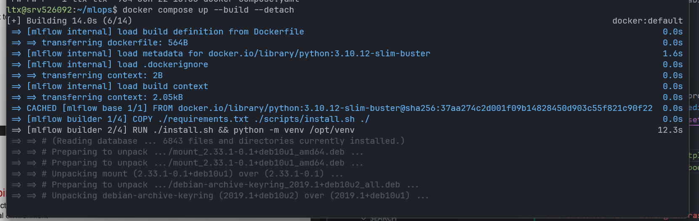
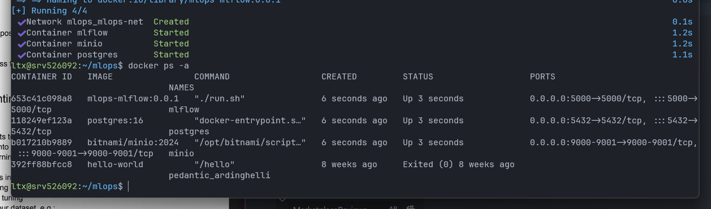
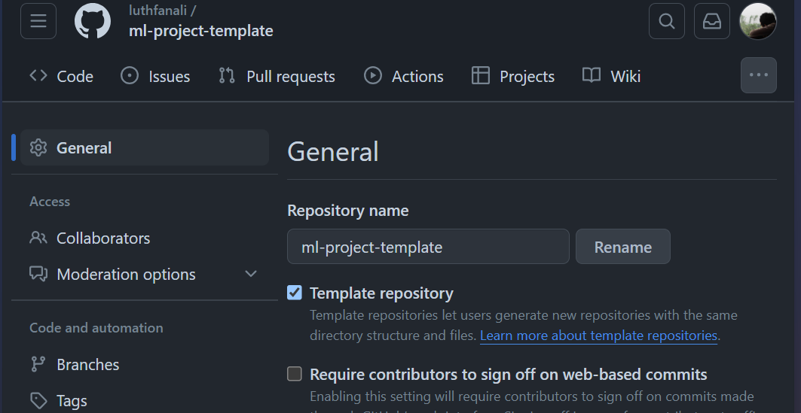

# **ML Project Template**


Steps:
+ Select **Use this template** > **Create a new repository**. This menu is in the top right corner of this repository.
+ Edit `setup.py` and define your the project repository.
    + Edit the [README.md](README.md) file's **workflow status** badge with the name of your repository.
    + Rename `src/MLProject` to your project name.
+ Create virtual environment

    ```bash
    virtualenv .venv -p /usr/bin/python3.10
    ```
  **Note:** You can use any Python version, as long the Python packages in `requirements.txt` are supported. Because of the Python packages in `requirements.txt` were declared without describe the version.
+ Activate the virtual environment

    ```bash
    source .venv/bin/activate
    ```

+ Install package.

    ```bash
    pip install -r requirements.txt
    ```

+ enable the environment variables.

    ```bash
    cp .env.example .env
    ```

## Dataset dan Model

Dataset yang digunakan dalam project kali ini adalah dataset dari kaggle: [Dataset Review Tokopedia dan Shopee](https://www.kaggle.com/datasets/silviamargareta/dataset-review)

- Unduh dataset tersebut
- Rename `CSV` menjadi `marketplace-reviews.csv`
- Masukkan dalam folder `notebooks/data/`

## Setup Infrasucture di AWS

### Instance #1: Tracking Infrastructure
- Setup pada VPS sendiri
- Copy ke dalam server seluruh file `others/docker-engine`
- Jalankan setup Docker `install-docker-engine.sh`
- Masuk ke folder `others/docker-engine/platforms` dan lakukan

    ```
    docker compose up --build --detach
    ```
    
- MinIO, MLFlow, dan Postgress telah berjalan 

    
- Buat database baru bernama `marketplace_reviews` di Postgress

### Instance #2

### Instance #3


## Setup Repository
- Buat repository baru di local computer. Repo ini bertujuan untuk jadi Template Machine Learning Project kita kedepannya
- Pada halaman Github, buat sebuah repo baru. 
- Kemudian di halaman Settings repo tersebut centang opsi `Template Repository` 

    
- Setelah selesai menyiapkan template project, lakukan `git push` 

## Setup Local Environment
- Buat repository baru bernama `marketplace-reviews` dengan memakai template [ML Project Template](https://github.com/luthfanali/ml-project-template)
- Clone ke dalam local computer dengan command 
    ```
    git clone git@github.com:luthfanali/marketplace-reviews.git
    ```
- Pada direktori project buat sebuah python environment baru dengan mengetik 
    ```
    python -m venv .marketplace-reviews-venv
    ```
- Kemudian instalasi semua dependensi python yang diperlukan dengan 
    ```
    pip install -r requirements.txt
    ```
- Edit project

- Pada MinIO, buat sebuah bucket baru dengan nama `marketplace-reviews-bucket`

- Buat DVC Pipeline
  - Inisialisasi DVC
    ```
    dvc init
    ```
  - Buat file `dvc.yaml` di project root directory, kemudian edit sesuai kebutuhan
  - Repro DVC
    ```
    dvc repro
    ```
  - Update DVC Configuration
    1.  Tambah bucket di MinIO ke dalam DVC
        ```
        dvc remote add -d storage s3://marketplace-reviews-dvc-pipeline-bucket
        ```
    2. Tambah Endpoint URL
        ```
        dvc remote modify storage endpointurl http://localhost:9000
        ```
    3. Masukkan Access Key ID Minio
        ```
        dvc remote modify storage access_key_id <akses_key_minio>
        ```
    4. Masukkan Secret Key MinIO
        ```
        dvc remote modify storage secret_access_key <secret_key_minio>
        ```
  - Push ke server dengan `dvc push`
  
- Commit seluruh perubahan
- Lakukan Push ke Github

## Experimenting, Evaluating and Comparing Models
- Repository sudah tersetup workflownya
- Dilakukan adjustment pada parameter model, dengan mengganti `MAX_ITER` dari 300 menjadi 100
- Diperoleh hasil seperti di bawah ini 

    

