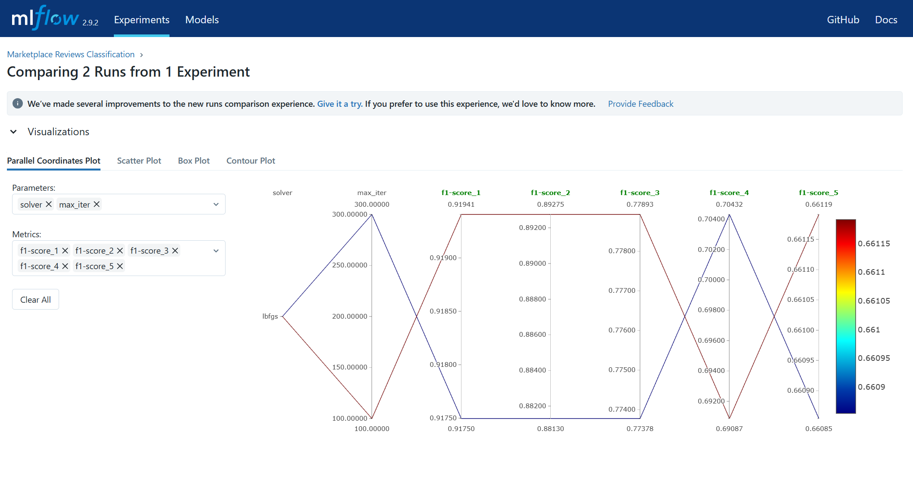
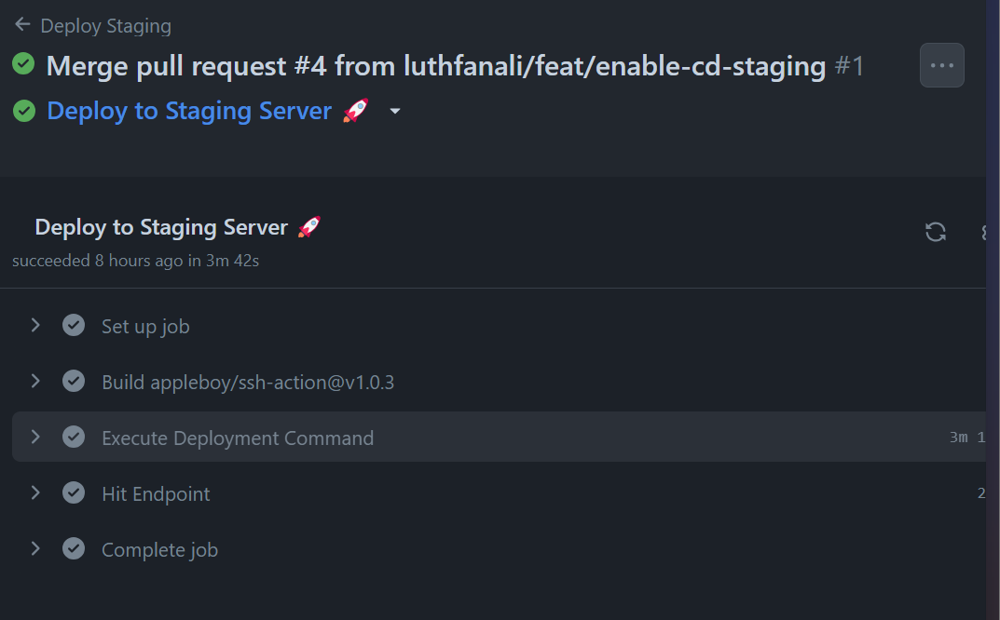
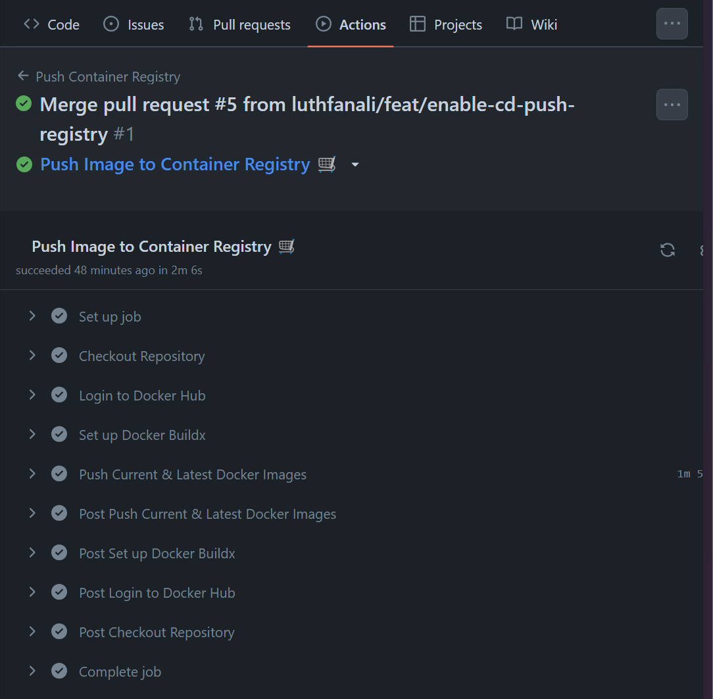
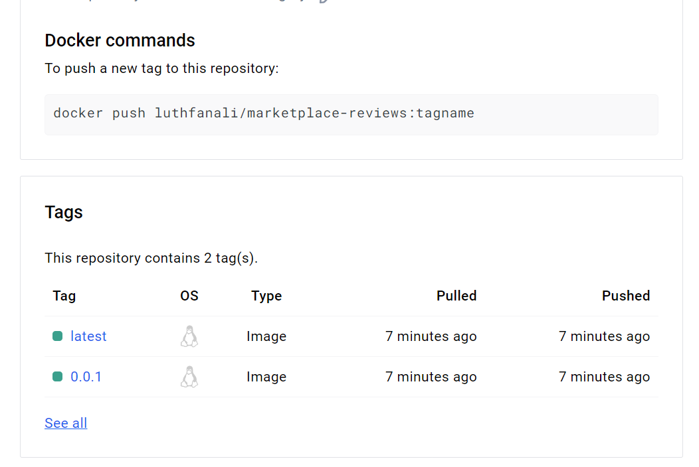

# **Marketplace Reviews Prediction**


## Dataset dan Model

Dataset yang digunakan dalam project kali ini adalah dataset dari kaggle: [Dataset Review Tokopedia dan Shopee](https://www.kaggle.com/datasets/silviamargareta/dataset-review)

- Unduh dataset tersebut
- Rename `CSV` menjadi `marketplace-reviews.csv`
- Masukkan dalam folder `notebooks/data/`

## Setup Infrasucture di AWS

### Instance #1: Tracking Infrastructure
- Setup pada VPS sendiri
- Copy ke dalam server seluruh file `others/docker-engine`
- Jalankan setup Docker `install-docker-engine.sh`
- Masuk ke folder `others/docker-engine/platforms` dan lakukan

    ```
    docker compose up --build --detach
    ```
    
- MinIO, MLFlow, dan Postgress telah berjalan 

    
- Buat database baru bernama `marketplace_reviews` di Postgress

### Instance #2
- Setup server AWS, t3a micro.
- Generate SSH Key, lalu tambahkan public key ke dalam Github Key
- Install docker di dalamnya

### Instance #3
- Setup server AWS, t3a micro.
- Generate SSH Key, lalu tambahkan public key ke dalam Github Key
- Install docker di dalamnya


## Setup Repository
- Buat repository baru di local computer. Repo ini bertujuan untuk jadi Template Machine Learning Project kita kedepannya
- Pada halaman Github, buat sebuah repo baru. 
- Kemudian di halaman Settings repo tersebut centang opsi `Template Repository` 

    
- Setelah selesai menyiapkan template project, lakukan `git push` 

## Setup Local Environment
- Buat repository baru bernama `marketplace-reviews` dengan memakai template [ML Project Template](https://github.com/luthfanali/ml-project-template)
- Clone ke dalam local computer dengan command 
    ```
    git clone git@github.com:luthfanali/marketplace-reviews.git
    ```
- Pada direktori project buat sebuah python environment baru dengan mengetik 
    ```
    python -m venv .marketplace-reviews-venv
    ```
- Kemudian instalasi semua dependensi python yang diperlukan dengan 
    ```
    pip install -r requirements.txt
    ```
- Edit project

- Pada MinIO, buat sebuah bucket baru dengan nama `marketplace-reviews-bucket`

- Buat DVC Pipeline
  - Inisialisasi DVC
    ```
    dvc init
    ```
  - Buat file `dvc.yaml` di project root directory, kemudian edit sesuai kebutuhan
  - Repro DVC
    ```
    dvc repro
    ```
  - Update DVC Configuration
    1.  Tambah bucket di MinIO ke dalam DVC
        ```
        dvc remote add -d storage s3://marketplace-reviews-dvc-pipeline-bucket
        ```
    2. Tambah Endpoint URL
        ```
        dvc remote modify storage endpointurl http://localhost:9000
        ```
    3. Masukkan Access Key ID Minio
        ```
        dvc remote modify storage access_key_id <akses_key_minio>
        ```
    4. Masukkan Secret Key MinIO
        ```
        dvc remote modify storage secret_access_key <secret_key_minio>
        ```
  - Push ke server dengan `dvc push`
  
- Commit seluruh perubahan
- Lakukan Push ke Github

## Experimenting, Evaluating and Comparing Models
- Repository sudah tersetup workflownya
- Dilakukan adjustment pada parameter model, dengan mengganti `MAX_ITER` dari 300 menjadi 100
- Diperoleh hasil seperti di bawah ini 

    

- Pilih model yang terbaik, lalu tambahkan alias `development` dan `staging`

## Setup CI/CD

### Integrasi CI
- Buat branch baru
  
  ```
  git checkout -b feat/enable-ci-unittest
  ``` 
- Buat pipeline untuk CI berupa `ci.yaml` dan masukkan dalam `.github/workflows`
- Commit perubahan dalam branch `feat/enable-ci-unittest`
- Lalu push ke Github
- Lakukan Pull Request
- Tunggu hingga proses testing selesai
  
  

- Lakukan merge apabila testing berhasil
  
  

### Integrasi CD
- Buat branch baru
  
  ```
  git checkout -b feat/enable-cd-staging
  ``` 
- Buat pipeline untuk CD berupa `cd-staging.yaml` dan masukkan dalam `.github/workflows`
- Commit perubahan dalam branch `feat/enable-cd-staging`
- Lalu push ke Github
- Pada pengaturan repository, tambahkan **Secret** dan **Vars** yang dibutuhkan sesuai dengan pipeline `cd-staging.yaml`
- Lakukan Pull Request
- Tunggu hingga proses testing dan deploying selesai
  
  
- Coba lakukan test API ke Server Staging
  
  

### Integrasi CD Push to Docker Registry dan App Versioning
#### Setup Repo Docker dan Key
- Pada akun Docker Hub, buat sebuah private repository baru bernama `marketplace-reviews`
- Kemudian buat credentials di [link ini](https://hub.docker.com/settings/security). Catat credentials yang didapat.
#### Buat branch `feat/enable-cd-push-registry` dan Push ke Github
- Buat branch baru
  
  ```
  git checkout -b feat/enable-cd-push-registry
  ``` 
- Buat pipeline untuk CD berupa `cd-push-registry.yaml` dan masukkan dalam `.github/workflows`
- Commit perubahan dalam branch `feat/enable-cd-push-registry`
- Buka repository Github. Pada pengaturan repository, tambahkan **Secret** dan **Vars** yang dibutuhkan sesuai dengan pipeline `cd-push-registry.yaml`
- Lalu push ke Github
- Lakukan Pull Request
- Merge
#### Release aplikasi
- Pastikan berada pada branch `master` dan lakukan `git pull`
- Github Workflows `cd-push-registry.yaml` ini akan otomatis tereksekusi ketika ada tags apapun di Repo Github
- Buat tags
  
  ```
  git tag -a "0.0.1" -m "release version 0.0.1"
  ```
- Untuk melihat semua tags
  
  ```
  git tags --list
  ```
- Push tags ke Repo Github
  
  ```
  git push -u origin 0.0.1
  ```
- Setelah dilakukan push, terlihat bahwa Pipeline CD Push Registry dijalankan. Tunggu hingga selesai.
  
  

- Cek di akun Docker Hub, telah ada docker image hasil dari `cd-push-registry.yaml`. 
  
  

- Kemudian pada repo Github buat **New Release**
- Pilih versi yang ingin di release
- Tunggu hingga proses github action selesai dan terdeploy ke Production Server